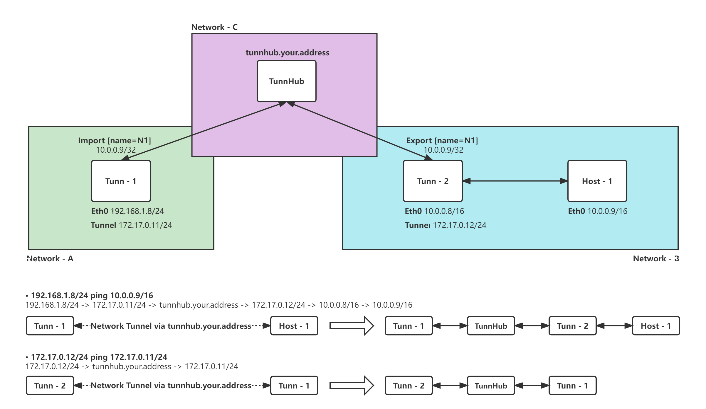

# TunnHub - NetworkTunnel Hub

 
本项目旨在于实现高速、安全、高质量的跨网络通信。通过创建网络隧道实现为用户提供虚拟局域网环境。支持多平台多种传输协议以及加密方式。适用于简单的异地组网等场景。

请勿用于非法用途，用户使用时自行承担风险，本项目不承担任何法律责任。
 
 
The purpose of this project is to implement the high-speed, safe and high-quality cross network connection. The virtual
LAN environment is provided for users by creating a network tunnel. It supports multiple platforms, multiple
transmission protocols and encryption methods. It is applicable to simple remote networking and other scenarios.

Please do not use it for illegal purposes. The user shall bear the risk when using it. This project will not bear any
legal responsibility.
 
 

# Instruction

------

#### TunnHub Document

[中文文档](./doc/tunnhub_cn.md) | [English](./doc/tunnhub_en.md)

#### Tunn Document

[中文文档](./doc/tunn_cn.md) | [English](./doc/tunn_en.md)