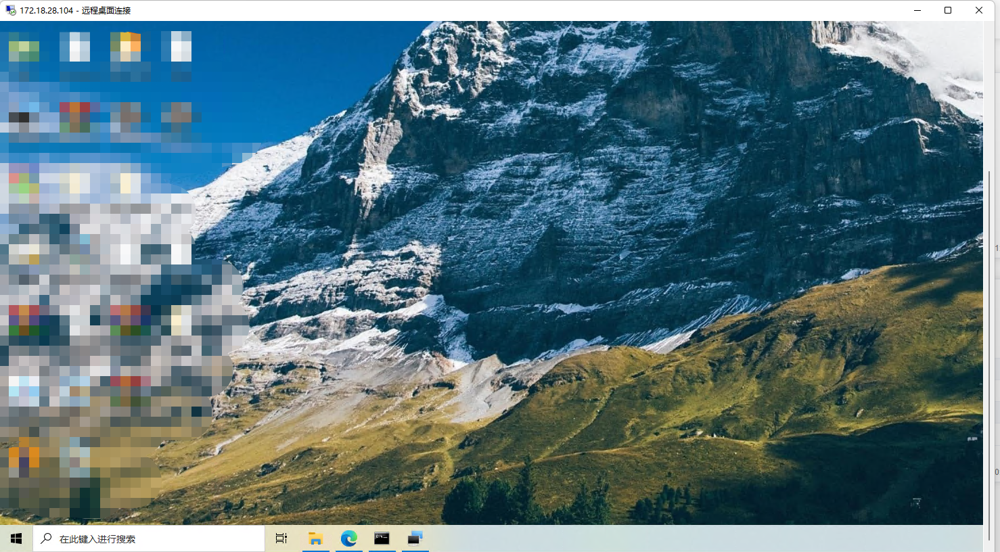

# 使用场景示例

------

! 所有文中出现的路径都可自行根据需求修改

#### 环境

| 名称               | 角色      | 操作系统                     | 内网地址       | 外网地址                    |
|------------------|---------|--------------------------|------------|-------------------------|
| 腾讯云-轻量级服务器 (x86) | TunnHub | CentOS 8.2               | 172.22.0.1 | tunnhub.gz.junqirao.icu |
| R2s (ARM)        | Tunn    | Ubuntu 20.04 LTS aarch64 | 172.22.0.2 |                         |
| 笔记本              | Tunn    | Windows11                | 动态分配       |                         |

需求 将与r2s同一网络的windows远程桌面(172.18.28.104)暴露到网络中供其他用户导入

## 腾讯云部署TunnHub

登录到腾讯云

#### 安装nodejs (如需要自行编译webui)

```shell
#安装nodejs
[root@VM-12-10-centos ~]# cd /usr/local
[root@VM-12-10-centos local]# wget https://nodejs.org/dist/v14.18.1/node-v14.18.1-linux-x64.tar.xz
[root@VM-12-10-centos local]# tar -xvf node-v14.18.1-linux-x64.tar.xz
[root@VM-12-10-centos local]# vim /etc/profile

#添加以下内容到/etc/profile
export NODE_HOME=/usr/local/node-v14.18.1-linux-x64
export PATH=$NODE_HOME/bin:$PATH

#刷新配置
[root@VM-12-10-centos local]# source /etc/profile

#验证
[root@VM-12-10-centos local]# node -v
v14.18.1
```

#### 安装golang

```shell
[root@VM-12-10-centos ~]# cd /usr/local
[root@VM-12-10-centos local]# wget https://golang.google.cn/dl/go1.18.2.linux-amd64.tar.gz
[root@VM-12-10-centos local]# tar -zxf go1.18.2.linux-amd64.tar.gz -C /usr/local

#添加以下内容到/etc/profile
export GOROOT=/usr/local/go 
export GOPATH=/local/gopath
export PATH=$PATH:$GOROOT/bin:$GOPATH/bin

#刷新配置
[root@VM-12-10-centos local]# source /etc/profile

#验证
[root@VM-12-10-centos local]# go version
go version go1.18 linux/amd64
```

#### 编译

```shell
#从仓库克隆代码
[root@VM-12-10-centos ~]# cd /home
[root@VM-12-10-centos home]# git clone https://github.com/yaooovesm/tunn-hub.git
Cloning into 'tunn-hub'...
remote: Enumerating objects: 1101, done.
remote: Counting objects: 100% (1101/1101), done.
remote: Compressing objects: 100% (388/388), done.
remote: Total 1101 (delta 693), reused 1095 (delta 687), pack-reused 0
Receiving objects: 100% (1101/1101), 1.01 MiB | 4.33 MiB/s, done.
Resolving deltas: 100% (693/693), done.

#进入目录
[root@VM-12-10-centos home]# cd ./tunn-hub
[root@VM-12-10-centos tunn-hub]#
```

自行编译webui

```shell
#进入webui目录
[root@VM-12-10-centos tunn-hub]# cd webui

#安装依赖
[root@VM-12-10-centos webui]# npm install

#build
[root@VM-12-10-centos webui]# npm run build

#将dist移动到cmd下
[root@VM-12-10-centos webui]# mv dist/ /home/tunn-hub/cmd/static
[root@VM-12-10-centos webui]# cd /home/tunn-hub/cmd/
```

或使用已编译的资源

```shell
[root@VM-12-10-centos tunn-hub]# unzip assets/static.zip -d cmd/
```

### 编译tunnhub

[root@VM-12-10-centos cmd]# go build -o tunnhub

```

#### 部署

```shell
[root@VM-12-10-centos cmd]# mkdir /home/tunnhub
[root@VM-12-10-centos cmd]# mv tunnhub /home/tunnhub/
[root@VM-12-10-centos cmd]# cd /home/tunnhub/
[root@VM-12-10-centos tunnhub]# ls
tunnhub
```

拷贝数据库文件

```shell
[root@VM-12-10-centos tunnhub]# cp /home/tunn-hub/tunn_server.db /home/tunnhub/
```

拷贝默认证书

```shell
[root@VM-12-10-centos tunnhub]# cp /home/tunn-hub/assets/* /home/tunnhub/
```

按实际需求修改配置文件 [示例](../config/tunnhub_config_full.json)

```shell
#此处按照本次部署的需求将global.address改为指定域名
#运行在端口10240
#使用wss传输
#mtu设为1450
#并发连接数设为1
"global": {
  "address": "tunnhub.gz.junqirao.icu",
  "port": 10240,
  "protocol": "wss",
  "mtu": 1450,
  "multi_connection": 1
}

#设备IP改为172.22.0.1对应TunnHub内网IP
"device": {
  "cidr": "172.22.0.1/24",
  "dns": "223.5.5.5"
}

#地址池起始地址为 172.22.0.11结束地址为 172.22.0.100
#地址池网络为 172.22.0.0/24
"ip_pool": {
  "start": "172.22.0.11",
  "end": "172.22.0.100",
  "network": "172.22.0.0/24"
}
```

```shell
#启动
[root@VM-12-10-centos tunnhub]# ./tunnhub -c hub.config
[INF][2022-05-31 15:59:06.096] load config from : hub.config
[INF][2022-05-31 15:59:06.097] [orm_data_encrypt_processor][fp:encrypt] register success
[INF][2022-05-31 15:59:06.097] [orm_data_encrypt_processor][fp:compress] register success
[INF][2022-05-31 15:59:06.097] [orm_data_decrypt_processor][fp:decompress] register success
[INF][2022-05-31 15:59:06.097] [orm_data_decrypt_processor][fp:decrypt] register success
[INF][2022-05-31 15:59:07.099] transmit protocol : wss
[INF][2022-05-31 15:59:07.099] application version : 1.0.0.220531
[INF][2022-05-31 15:59:07.099] [cipher:32] update key
[INF][2022-05-31 15:59:07.099] convert to hex -> 52716b0c5725429bac23a8c0e5766e5c9f4a345770ad44dc80a15c543d49ebaf
[INF][2022-05-31 15:59:07.099] reporter work at : 0.0.0.0:8889
[INF][2022-05-31 15:59:07.099] admin work at : 0.0.0.0:8888
[INF][2022-05-31 15:59:07.099] admin tls on
[INF][2022-05-31 15:59:07.100] pprof serve on 0.0.0.0:10242
[WRN][2022-05-31 15:59:07.105] device.dns config only work in windows value is ignored : 223.5.5.5
[WRN][2022-05-31 15:59:07.105] you need to setup dns manually
[INF][2022-05-31 15:59:07.105] [global_rx][fp:rx_flow_statistics] register success
[INF][2022-05-31 15:59:07.107] set encrypt cipher [XOR]
[INF][2022-05-31 15:59:07.107] [global_tx][fp:tx_encrypt] register success
[INF][2022-05-31 15:59:07.107] [global_tx][fp:tx_flow_statistics] register success
[INF][2022-05-31 15:59:07.107] service init success...
[INF][2022-05-31 15:59:07.107] authentication server listen on : 0.0.0.0:10241
[INF][2022-05-31 15:59:07.107] server listen on : 0.0.0.0:10240
[INF][2022-05-31 15:59:07.107] wss endpoint : /026d7cfaa17b45c4800028e5cf08ecd0/access_point
```

打开浏览器


使用默认用户和密码登录到控制台

    webui default user     : admin
    webui default password : P@ssw0rd

<span style="color:red">! 第一次登录后请务必修改默认密码</span>


进入证书管理页

生成证书

创建成功如图


```shell
# Ctrl+C 终止运行中的TunnHub
^C
[INF][2022-05-31 17:14:22.634] receive stop signal : interrupt
[INF][2022-05-31 17:14:22.634] rx counter dumped
[INF][2022-05-31 17:14:22.634] tx counter dumped
[INF][2022-05-31 17:14:22.634] commit all users flow counter
[INF][2022-05-31 17:14:22.634] commit done
[INF][2022-05-31 17:14:22.634] application stopped
[INF][2022-05-31 17:14:22.634] tunn-hub stopped

#重启服务器以应用证书设置
[root@VM-12-10-centos tunnhub]# ./tunnhub -c hub.config
```

勾选 "我已知晓风险" 下载证书


按照需求创建用户r2s，并设置静态IP分配172.22.0.2/24


同样方法创建用户windows但无需设置静态IP分配

TunnHub至此准备完成

## R2s ARM平台部署Tunn

#### 编译

```shell
#安装golang1.18.2或更高版本，与上文基本相同，下载对应架构即可
root@FriendlyELEC:~# go version
go version go1.18 linux/arm64
root@FriendlyELEC:~# 

#克隆仓库
root@FriendlyELEC:~# cd /home/
root@FriendlyELEC:/home# git clone https://github.com/yaooovesm/tunn.git
Cloning into 'tunn'...
remote: Enumerating objects: 688, done.
remote: Counting objects: 100% (688/688), done.
remote: Compressing objects: 100% (277/277), done.
remote: Total 688 (delta 383), reused 687 (delta 382), pack-reused 0
Receiving objects: 100% (688/688), 433.30 KiB | 1.74 MiB/s, done.
Resolving deltas: 100% (383/383), done.

#此处不再单独编译前端，使用预先编译好的资源
#将assets/static.zip解压到cmd目录下
root@FriendlyELEC:/home# cd tunn/
root@FriendlyELEC:/home/tunn# unzip assets/static.zip -d cmd/
root@FriendlyELEC:/home/tunn# cd cmd/
root@FriendlyELEC:/home/tunn/cmd# ls
main.go  static

#编译
root@FriendlyELEC:/home/tunn/cmd# go build -o tunn
root@FriendlyELEC:/home/tunn/cmd# ls
main.go  static  tunn
root@FriendlyELEC:/home/tunn/cmd# 
```

#### 使用

```shell
root@FriendlyELEC:/home/tunn/cmd# mkdir /home/tunnc
root@FriendlyELEC:/home/tunn/cmd# mv tunn /home/tunnc/
root@FriendlyELEC:/home/tunn/cmd# cd /home/tunnc
```

将上文下载的证书上传到/home/tunnc下

```shell
root@FriendlyELEC:/home/tunnc# ls
489effdbc1f24ed480e6d01960515d95.cert  tunn
```

创建配置文件client.config如下

```json
{
  "user": {
    "Account": "r2s",
    "Password": ""
  },
  "auth": {
    "Address": "tunnhub.gz.junqirao.icu",
    "Port": 10241
  },
  "security": {
    "cert": "489effdbc1f24ed480e6d01960515d95.cert"
  },
  "admin": {
    "address": "0.0.0.0",
    "port": 8080,
    "user": "admin",
    "password": "admin"
  }
}
```

tunnc目录如下

```shell
root@FriendlyELEC:/home/tunnc# ls
489effdbc1f24ed480e6d01960515d95.cert  client.config  tunn
root@FriendlyELEC:/home/tunnc# 
```

启动

```shell
root@FriendlyELEC:/home/tunnc# ./tunn -c client.config 
[INF][2022-06-01 09:27:42.986] load config from : client.config
[INF][2022-06-01 09:27:42.99] admin work at : 0.0.0.0:8080
for control please access link: 
http://127.0.0.1:8080
```

进入控制台 使用上文配置文件中设置的admin.user与admin.password作为用户名密码登录


使用上文创建的r2s用户的密码登录


r2s登录成功并被静态分配为172.22.0.2

```shell
root@FriendlyELEC:/home/tunnc# ./tunn -c client.config 
[INF][2022-06-01 09:34:07.979] load config from : client.config
[INF][2022-06-01 09:34:07.983] admin work at : 0.0.0.0:8080
for control please access link: 
http://127.0.0.1:8080
[INF][2022-06-01 09:34:19.331] config dump to : client.config
[INF][2022-06-01 09:34:19.333] tunnel version : 1.0.0.220531
[INF][2022-06-01 09:34:19.334] service init success...
[INF][2022-06-01 09:34:19.335] tunnel start...
[INF][2022-06-01 09:34:19.335] connect to authentication server : tunnhub.gz.junqirao.icu:10241
[INF][2022-06-01 09:34:19.819] receive 32 bytes key from server
[INF][2022-06-01 09:34:19.82] login success
[INF][2022-06-01 09:34:19.841] transmit protocol : wss
[INF][2022-06-01 09:34:19.862] multi connection size : 1
[INF][2022-06-01 09:34:19.862] connect to wss server : wss://tunnhub.gz.junqirao.icu:10240/1cc788fccdfd490e9fd51760ec047723/access_point
[INF][2022-06-01 09:34:20.001] send confirm packet : 08c7d516afb24027a88a7d33de232bd7
[INF][2022-06-01 09:34:20.017] connected to the server successfully!
[INF][2022-06-01 09:34:20.017] your ip address is 172.22.0.2/24.
```

验证

```shell
#r2s验证
root@FriendlyELEC:/home/tunnc# ping 172.22.0.1 -c 10
PING 172.22.0.1 (172.22.0.1) 56(84) bytes of data.
64 bytes from 172.22.0.1: icmp_seq=1 ttl=64 time=15.8 ms
64 bytes from 172.22.0.1: icmp_seq=2 ttl=64 time=15.8 ms
64 bytes from 172.22.0.1: icmp_seq=3 ttl=64 time=15.8 ms
64 bytes from 172.22.0.1: icmp_seq=4 ttl=64 time=15.8 ms
64 bytes from 172.22.0.1: icmp_seq=5 ttl=64 time=15.4 ms
64 bytes from 172.22.0.1: icmp_seq=6 ttl=64 time=15.3 ms
64 bytes from 172.22.0.1: icmp_seq=7 ttl=64 time=15.9 ms
64 bytes from 172.22.0.1: icmp_seq=8 ttl=64 time=15.7 ms
64 bytes from 172.22.0.1: icmp_seq=9 ttl=64 time=15.6 ms
64 bytes from 172.22.0.1: icmp_seq=10 ttl=64 time=15.6 ms

--- 172.22.0.1 ping statistics ---
10 packets transmitted, 10 received, 0% packet loss, time 9015ms
rtt min/avg/max/mdev = 15.330/15.666/15.917/0.180 ms
root@FriendlyELEC:/home/tunnc# 

#腾讯云验证
[root@VM-12-10-centos ~]# ping 172.22.0.2 -c 10
PING 172.22.0.2 (172.22.0.2) 56(84) bytes of data.
64 bytes from 172.22.0.2: icmp_seq=1 ttl=64 time=16.3 ms
64 bytes from 172.22.0.2: icmp_seq=2 ttl=64 time=16.0 ms
64 bytes from 172.22.0.2: icmp_seq=3 ttl=64 time=15.9 ms
64 bytes from 172.22.0.2: icmp_seq=4 ttl=64 time=15.4 ms
64 bytes from 172.22.0.2: icmp_seq=5 ttl=64 time=15.9 ms
64 bytes from 172.22.0.2: icmp_seq=6 ttl=64 time=14.8 ms
64 bytes from 172.22.0.2: icmp_seq=7 ttl=64 time=15.6 ms
64 bytes from 172.22.0.2: icmp_seq=8 ttl=64 time=15.9 ms
64 bytes from 172.22.0.2: icmp_seq=9 ttl=64 time=15.9 ms
64 bytes from 172.22.0.2: icmp_seq=10 ttl=64 time=15.4 ms

--- 172.22.0.2 ping statistics ---
10 packets transmitted, 10 received, 0% packet loss, time 9015ms
rtt min/avg/max/mdev = 14.795/15.704/16.296/0.422 ms
[root@VM-12-10-centos ~]#
```

## Windows平台部署Tunn

安装对应架构与平台的golang环境 [下载](https://golang.google.cn/dl/)

打开cmd

```shell
E:\TunnelTest>git clone https://github.com/yaooovesm/tunn.git
Cloning into 'tunn'...
remote: Enumerating objects: 699, done.
remote: Counting objects: 100% (699/699), done.
remote: Compressing objects: 100% (283/283), done.
Receiving objects: 100% (699/699)used 696 (delta 386), pack-reused 0
Receiving objects: 100% (699/699), 1.80 MiB | 6.54 MiB/s, done.
Resolving deltas: 100% (389/389), done.

E:\TunnelTest>cd tunn\cmd
```

将静态资源解压到cmd目录下

```shell
E:\TunnelTest\tunn\cmd>dir

2022/06/01  09:50    <DIR>          .
2022/06/01  09:46    <DIR>          ..
2022/06/01  09:46               540 main.go
2022/06/01  09:50    <DIR>          static
               1 个文件            540 字节
               3 个目录 470,264,983,552 可用字节

E:\TunnelTest\tunn\cmd>

#编译
E:\TunnelTest\tunn\cmd>go build -o tunn.exe
go: downloading github.com/klauspost/compress v1.15.3
go: downloading golang.org/x/crypto v0.0.0-20220315160706-3147a52a75dd

E:\TunnelTest\tunn\cmd>dir

2022/06/01  09:52    <DIR>          .
2022/06/01  09:46    <DIR>          ..
2022/06/01  09:46               540 main.go
2022/06/01  09:50    <DIR>          static
2022/06/01  09:52        18,648,064 tunn.exe
               2 个文件     18,648,604 字节
               3 个目录 470,246,334,464 可用字节

E:\TunnelTest\tunn\cmd>
```

将tunn.exe拷贝到E:\TunnelTest\tunnc下，并准备证书与配置文件如下

```json
{
  "user": {
    "Account": "windows",
    "Password": ""
  },
  "auth": {
    "Address": "tunnhub.gz.junqirao.icu",
    "Port": 10241
  },
  "security": {
    "cert": "489effdbc1f24ed480e6d01960515d95.cert"
  },
  "admin": {
    "address": "0.0.0.0",
    "port": 8080,
    "user": "admin",
    "password": "admin"
  }
}
```

下载对应架构和系统的 [wintun](https://www.wintun.net/) 驱动并与tunnc.exe置于同一目录

设置以管理员运行


以管理员身份重新打开cmd，并进入目录


进入控制台 使用上文配置文件中设置的admin.user与admin.password作为用户名密码登录


控制台输出如下

```shell
E:\TunnelTest\tunnc>tunn.exe -c tunnc.config
[INF][2022-06-01 10:19:13.429] load config from : tunnc.config
[INF][2022-06-01 10:19:13.439] admin work at : 0.0.0.0:8080
for control please access link:
http://127.0.0.1:8080
[INF][2022-06-01 10:19:30.491] config dump to : tunnc.config
[INF][2022-06-01 10:19:30.492] tunnel version : 1.0.0.220531
[INF][2022-06-01 10:19:30.492] service init success...
[INF][2022-06-01 10:19:30.492] tunnel start...
[INF][2022-06-01 10:19:30.493] connect to authentication server : tunnhub.gz.junqirao.icu:10241
[INF][2022-06-01 10:19:30.546] receive 32 bytes key from server
[INF][2022-06-01 10:19:30.547] login success
[INF][2022-06-01 10:19:30.549] transmit protocol : wss
2022/06/01 10:19:30 Using existing driver 0.14
2022/06/01 10:19:30 Creating adapter
2022/06/01 10:19:31 Removed orphaned adapter "tunnel 1"
[INF][2022-06-01 10:19:32.015] multi connection size : 1
[INF][2022-06-01 10:19:32.015] connect to wss server : wss://tunnhub.gz.junqirao.icu:10240/1cc788fccdfd490e9fd51760ec047723/access_point
[INF][2022-06-01 10:19:32.045] send confirm packet : 5fef029c1c8e4e8c86d175d32833fa4c
[INF][2022-06-01 10:19:32.06] connected to the server successfully!
[INF][2022-06-01 10:19:32.06] your ip address is 172.22.0.11/24.
```

! 请勿关闭cmd否则会断开连接

验证

```shell
C:\Users\89412>ping 172.22.0.1

正在 Ping 172.22.0.1 具有 32 字节的数据:
来自 172.22.0.1 的回复: 字节=32 时间=5ms TTL=64
来自 172.22.0.1 的回复: 字节=32 时间=6ms TTL=64
来自 172.22.0.1 的回复: 字节=32 时间=6ms TTL=64
来自 172.22.0.1 的回复: 字节=32 时间=6ms TTL=64

172.22.0.1 的 Ping 统计信息:
    数据包: 已发送 = 4，已接收 = 4，丢失 = 0 (0% 丢失)，
往返行程的估计时间(以毫秒为单位):
    最短 = 5ms，最长 = 6ms，平均 = 5ms

C:\Users\89412>ping 172.22.0.2

正在 Ping 172.22.0.2 具有 32 字节的数据:
来自 172.22.0.2 的回复: 字节=32 时间=22ms TTL=64
来自 172.22.0.2 的回复: 字节=32 时间=22ms TTL=64
来自 172.22.0.2 的回复: 字节=32 时间=21ms TTL=64
来自 172.22.0.2 的回复: 字节=32 时间=21ms TTL=64

172.22.0.2 的 Ping 统计信息:
    数据包: 已发送 = 4，已接收 = 4，丢失 = 0 (0% 丢失)，
往返行程的估计时间(以毫秒为单位):
    最短 = 21ms，最长 = 22ms，平均 = 21ms

C:\Users\89412>
```

在r2s也可以成功ping到windows并且延迟约等于windows->hub + r2s->hub = 6+16 = 22ms

```shell
root@FriendlyELEC:/home/tunnc# ping 172.22.0.11 -c 10
PING 172.22.0.11 (172.22.0.11) 56(84) bytes of data.
64 bytes from 172.22.0.11: icmp_seq=1 ttl=64 time=21.4 ms
64 bytes from 172.22.0.11: icmp_seq=2 ttl=64 time=22.2 ms
64 bytes from 172.22.0.11: icmp_seq=3 ttl=64 time=22.2 ms
64 bytes from 172.22.0.11: icmp_seq=4 ttl=64 time=22.8 ms
64 bytes from 172.22.0.11: icmp_seq=5 ttl=64 time=22.3 ms
64 bytes from 172.22.0.11: icmp_seq=6 ttl=64 time=21.1 ms
64 bytes from 172.22.0.11: icmp_seq=7 ttl=64 time=21.3 ms
64 bytes from 172.22.0.11: icmp_seq=8 ttl=64 time=22.1 ms
64 bytes from 172.22.0.11: icmp_seq=9 ttl=64 time=22.4 ms
64 bytes from 172.22.0.11: icmp_seq=10 ttl=64 time=22.0 ms

--- 172.22.0.11 ping statistics ---
10 packets transmitted, 10 received, 0% packet loss, time 9015ms
rtt min/avg/max/mdev = 21.067/21.969/22.793/0.515 ms
root@FriendlyELEC:/home/tunnc# 
```

以admin用户登录控制台可以看到在线用户与被分配的IP地址


## 网络暴露与导入

本操作可在hub控制台或客户端控制台执行

在TunnHub webui登录r2s用户


点击网络配置，可以看到目前还没有可以导入的网络


现有需求要将与r2s同一网络的windows远程桌面(172.18.28.104)暴露到网络中供其他用户导入

点击网络暴露下的添加名称为"远程桌面(104)"的暴露地址为172.18.28.104/32并点击保存


由于r2s需要暴露网络且操作系统为linux，需要进行一些额外设置

```shell
#开启内核转发
root@FriendlyELEC:/home/tunnc# echo 1 > /proc/sys/net/ipv4/ip_forward
#开启地址伪装
root@FriendlyELEC:/home/tunnc# iptables -t nat -A  POSTROUTING -s 172.22.0.0/24 -j MASQUERADE
```

重启r2s客户端或重置连接


等待r2s客户端离线后重连

在windows客户端登录webui，可以看到已经有名称为"远程桌面(104)"的网络可供导入


导入网络并重置连接后验证

```shell
C:\Users\89412>ping 172.18.28.104

正在 Ping 172.18.28.104 具有 32 字节的数据:
来自 172.18.28.104 的回复: 字节=32 时间=21ms TTL=127
来自 172.18.28.104 的回复: 字节=32 时间=22ms TTL=127
来自 172.18.28.104 的回复: 字节=32 时间=22ms TTL=127
来自 172.18.28.104 的回复: 字节=32 时间=22ms TTL=127

172.18.28.104 的 Ping 统计信息:
    数据包: 已发送 = 4，已接收 = 4，丢失 = 0 (0% 丢失)，
往返行程的估计时间(以毫秒为单位):
    最短 = 21ms，最长 = 22ms，平均 = 21ms

C:\Users\89412>
```

尝试通过172.18.28.104登录远程桌面



