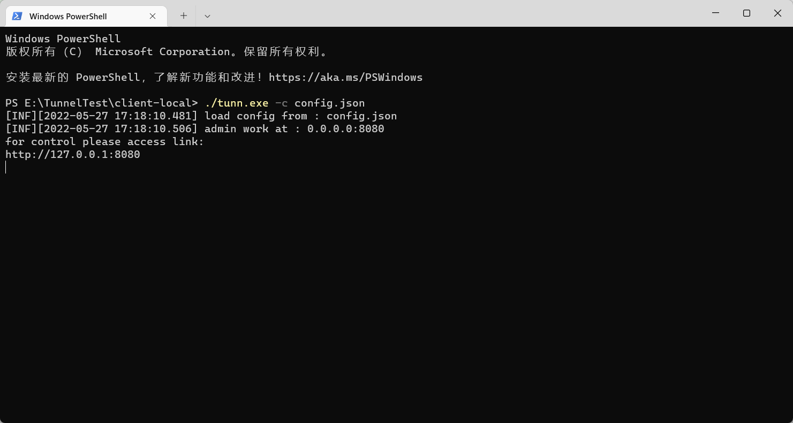
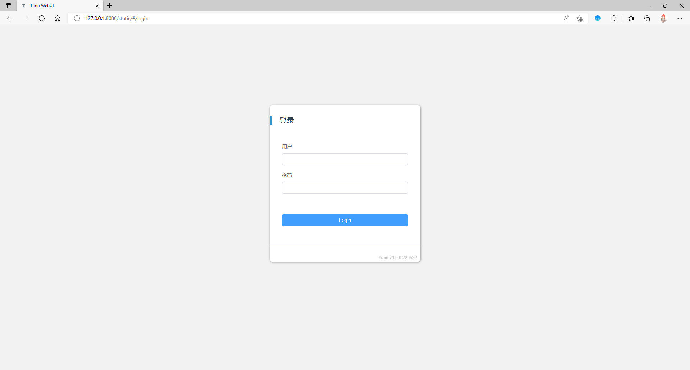
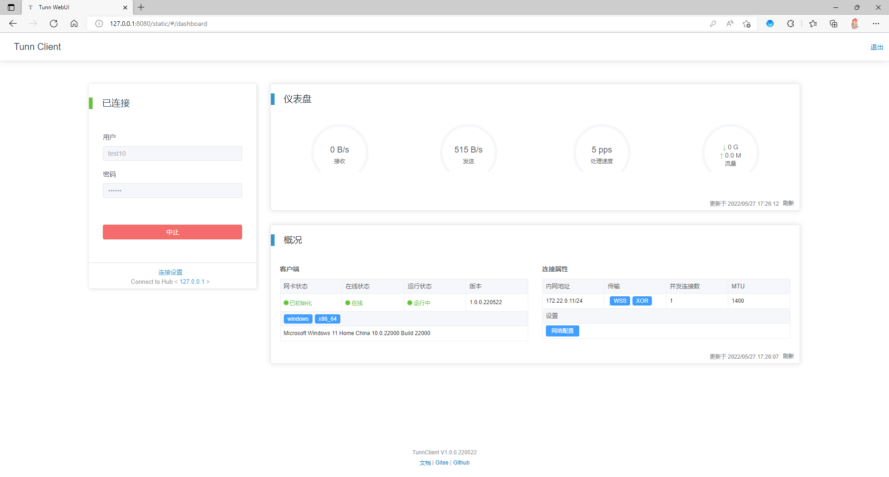

# Tunn - NetworkTunnel

<br>

[中文文档](tunn_cn.md) | [English](tunn_en.md)


<br>

### 特性

--------

#### 支持的操作系统

已测试的操作系统：

- Windows 7/10/11
- CentOS 7.x
- Ubuntu 20.x

理论支持：

- Windows 7+
- 支持tun设备的Linux发行版

#### 支持的传输协议

TCP / KCP / WS / WSS

#### 支持的加密方式

AES256 / AES192 / AES128 / XOR / SM4 / TEA / XTEA / Salsa20 / Blowfish

### 更新

------

2022/05/27 @ 1.0.0.220527

- WebUI
- 系统路由导入自动化
- 客户端配置操作

2022/05/10 @ 0.0.1

- 分离自项目 [Tunnel](https://gitee.com/jackrabbit872568318/tunnel)

2022/05/09 @ 历史更新

- 解决在NAT网路中的通信问题
- windows客户端支持
- 数据包CRC32校验
- ws/wss/tcp/kcp通信协议支持
- 路由暴露/导入
- 多通道传输
- 数据加密
- ...

### 编译

------

需要安装Go1.18.2或者更高版本 [下载](https://golang.google.cn/dl/)

准备

```shell
#拉取仓库
git clone https://gitee.com/jackrabbit872568318/tunn.git

#进入目录
cd ./tunn

#下载依赖
set GO111MODULE=on
go mod tidy

#进入cmd目录
cd cmd
```

编译

```shell
# @linux
go build -o tunn
```

或

```shell
# @windows
go build -o tunn.exe
```

### 使用

------

#### 客户端配置示例

[配置文件](../config/tunn_config_full.json)

说明

```shell
#Hub用户
user.Account
#Hub密码 (在设置密码时将会自动连接)
user.Password

#认证服务器地址
auth.Address
#认证服务器端口
auth.Port

#Hub认证证书
security.cert

#控制台地址
admin.address
#控制台端口
admin.port
#控制台用户
admin.user
#控制台密码
admin.password
```

示例

```json
{
  "user": {
    "Account": "account",
    "Password": "password"
  },
  "auth": {
    "Address": "aaa.bbb.ccc",
    "Port": 10241
  },
  "security": {
    "cert": "cert.pem"
  },
  "admin": {
    "address": "127.0.0.1",
    "port": 8080,
    "user": "admin",
    "password": "P@ssw0rd"
  }
}
```

#### 启动

! 当Linux客户端暴露网络时需要手动设置路由转发，并且开启内核转发。
```shell
#开启内核转发
echo 1 > /proc/sys/net/ipv4/ip_forward
#开启地址伪装
#e.g. iptables -t nat -A  POSTROUTING -s 192.168.0.0/24 -j MASQUERADE
iptables -t nat -A  POSTROUTING -s [tunn network] -j MASQUERADE
```

! Windows需要以管理员模式启动 <br>
! Windows需要下载 [wintun](https://www.wintun.net/) 驱动并与可执行文件在同一目录下 

启动参数

- -c 指定配置文件路径

示例：

```shell
# @linux
./tunn -c config.json
```

或

```shell
# @windows
tunn.exe -c config.json
```

启动成功如图



打开浏览器


进入控制台
