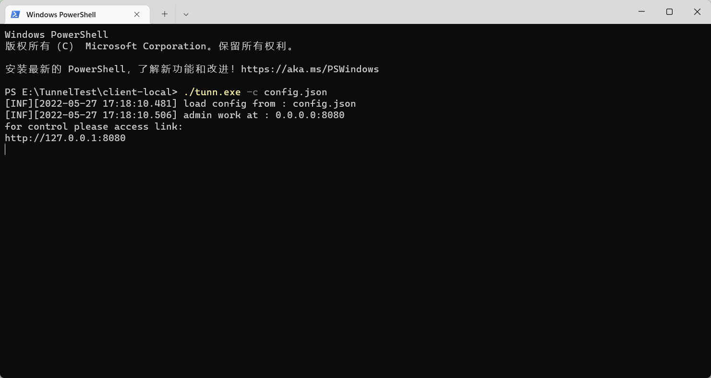
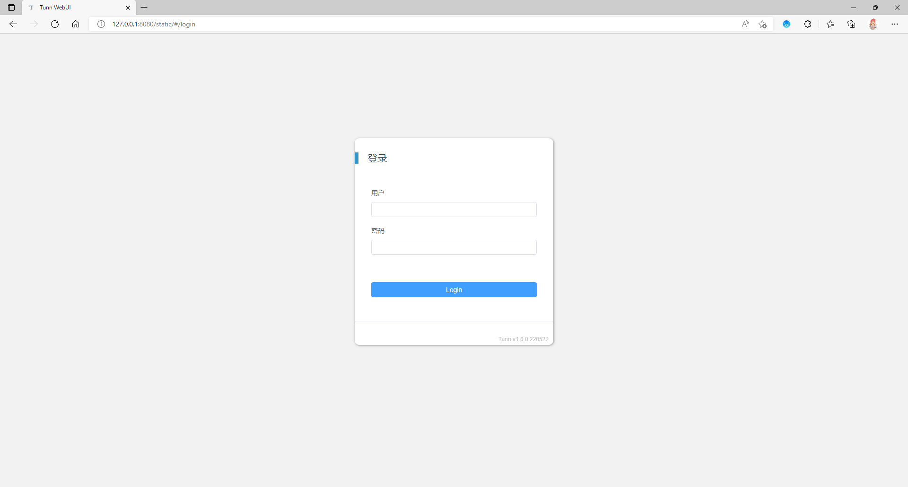

# Tunn - NetworkTunnel

<br>

[中文文档](./README_CN.md) | [English](./README_EN.md)

<br>

### Features

--------

#### Supported OS

tested：

- Windows 7/10/11
- CentOS 7.x
- Ubuntu 20.x

may support：

- Windows 7+
- Linux release supports tun device

#### Supported transmit protocols

TCP / KCP / WS / WSS

#### Supported encryption methods

AES256 / AES192 / AES128 / XOR / SM4 / TEA / XTEA / Salsa20 / Blowfish

### Updates

------

2022/05/31 @ 1.0.0.220531

- WebUI
- automatic import system route table
- config from client

2022/05/10 @ 0.0.1

- detached from project [Tunnel](https://gitee.com/jackrabbit872568318/tunnel)

2022/05/09 @ history

- work in NAT network
- windows support
- packet CRC32 checksum
- ws/wss/tcp/kcp support
- network export / import
- multi connection
- data encrypt
- ...

### Compile

------

Needs Go1.18.2 or higher [download](https://golang.google.cn/dl/) <br>
Needs nodejs [download](https://nodejs.org/en/download/)

preparation

```shell
#clone repository
git clone https://github.com/yaooovesm/tunn.git

#change directory to tunn
cd ./tunn
```

Compile WebUI

```shell
#@ tunn/
#change directory to tunn/webui
cd webui

#dependencies
npm install

#build
npm run build
```

! after build, move 'dist' to tunn/cmd and rename as 'static'

Compile Tunn

```shell
#dependencies
set GO111MODULE=on
go mod tidy

#change direction to tunn/cmd
cd cmd
```

```shell
# @linux
go build -o tunn
```

or

```shell
# @windows
go build -o tunn.exe
```

### Use

------

#### Client config example

[Config File](../config/config_full.json)

Descriptions

```shell
#Hub account
user.Account
#Hub password (auto login if password were set)
user.Password

#authentication server address
auth.Address
#authentication server port
auth.Port

#Hub certification
security.cert

#admin webui address
admin.address
#admin webui port
admin.port
#admin webui user
admin.user
#admin webui password
admin.password
```

Example

```json
{
  "user": {
    "Account": "account",
    "Password": "password"
  },
  "auth": {
    "Address": "aaa.bbb.ccc",
    "Port": 10241
  },
  "security": {
    "cert": "cert.pem"
  },
  "admin": {
    "address": "127.0.0.1",
    "port": 8080,
    "user": "admin",
    "password": "P@ssw0rd"
  }
}
```

#### Startup

! forward function should be enabled, when export network in Linux client

```shell
#enable ip forward in kernel
echo 1 > /proc/sys/net/ipv4/ip_forward
#setup iptables
#e.g. iptables -t nat -A  POSTROUTING -s 192.168.0.0/24 -j MASQUERADE
iptables -t nat -A  POSTROUTING -s [tunn network] -j MASQUERADE
```

! Windows needs Privileges <br>
! Windows needs download [wintun](https://www.wintun.net/) driver with executable file

Start parameters

- -c set witch config should load

Example:

```shell
# @linux
./tunn -c config.json
```

or

```shell
# @windows
tunn.exe -c config.json
```

Start up successfully like this



Open your browser


Enter dashboard
