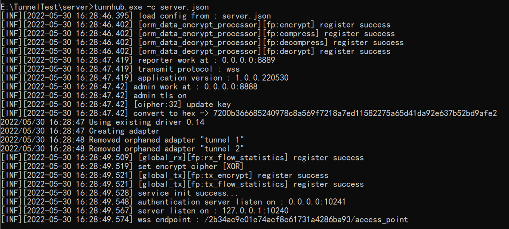
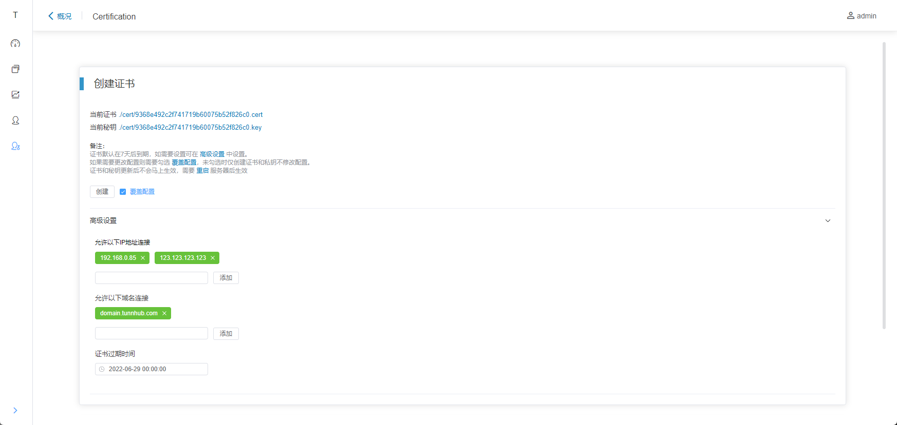

# TunnHub - NetworkTunnel Hub

<br>

[中文文档](./tunnhub_cn.md) | [English](./tunnhub_en.md)

<br>

### Features

--------

tested：

- Windows 7/10/11
- CentOS 7.x
- Ubuntu 20.x

may support：

- Windows 7+
- Linux release supports tun device

#### Supported transmit protocols

TCP / KCP / WS / WSS

#### Supported encryption methods

AES256 / AES192 / AES128 / XOR / SM4 / TEA / XTEA / Salsa20 / Blowfish

### Updates

------

2022/05/27 @ 1.0.0.220527

- Remake authentication server
- Certification manage
- Webui websocket support
- Adjust network export/import
- System monitor
- Network interface data storage
- Reset/Disconnect remotely
- Static Ip

2022/05/10 @ 0.0.1

- detached from project [Tunnel](https://gitee.com/jackrabbit872568318/tunnel)

### Compile

------

Needs Go1.18.2 or higher [download](https://golang.google.cn/dl/) <br>
Needs GCC, Windows use [mingw-w64](https://www.mingw-w64.org/) <br>
Needs nodejs [download](https://nodejs.org/en/download/)

Prepare

```shell
#clone repository
git clone https://gitee.com/jackrabbit872568318/tunn-hub.git

#into repository directory
cd ./tunn-hub
```

Compile WebUI

```shell
#@ tunn-hub/
#change directory to tunn-hub/webui
cd webui

#dependencies
npm install

#build
npm run build
```

! after build, move 'dist' to tunn-hub/cmd and rename as 'static'

Compile TunnHub

```shell
#dependencies
set GO111MODULE=on
go mod tidy

#change direction to tunn-hub/cmd
cd cmd
```

```shell
# @linux
go build -o tunnhub
```

or

```shell
# @windows
go build -o tunnhub.exe
```

### Use

------

#### Client config example

[Config File](../config/tunnhub_config_full.json)

Descriptions

```shell
#Transmit serve address (0.0.0.0)
global.address
#Transmit serve port
global.port
#Transmit protocol
global.protocol
#MTU default(1400)
global.mtu
#Client multi connection count
global.multi_connection

#network name
route.name
#Only supports network Export in Hub
route.option
#Network CIDR，e.g. 192.168.0.0/24，192.168.1.254/32
route.network

#Network Device CIDR
device.cidr
#Network Device DNS (windows only)
device.dns

#Authentication server address (0.0.0.0)
auth.address
#Authentication server port
auth.port

#Data encrypt method, transmit raw when blank value set 
data_process.encrypt

#cert file path
security.cert
#ket file path
security.key

#Admin webui address(0.0.0.0)
admin.address
#Admin webui port
admin.port
#Admin webui Reporter port (for data access)
admin.reporter
#Admin webui Https switch
admin.https
#sqlite database file
admin.db_file

#ip pool dynamic dispatch start address
ip_pool.start
#ip pool dynamic dispatch end address
ip_pool.end
#ip pool network e.g. 192.168.10.0/24
ip_pool.network
```

Example

```json
{
  "global": {
    "address": "127.0.0.1",
    "port": 10240,
    "protocol": "wss",
    "mtu": 1400,
    "multi_connection": 1
  },
  "route": [
    {
      "name": "test_route",
      "option": "export",
      "network": "10.10.10.10/32"
    }
  ],
  "device": {
    "cidr": "172.22.0.1/24",
    "dns": "223.5.5.5"
  },
  "auth": {
    "address": "0.0.0.0",
    "port": 10241
  },
  "data_process": {
    "encrypt": "XOR"
  },
  "security": {
    "cert": "./cert.pem",
    "key": "./key.pem"
  },
  "admin": {
    "address": "0.0.0.0",
    "port": 8888,
    "reporter": 8889,
    "https": true,
    "db_file": "./tunn_server.db"
  },
  "ip_pool": {
    "start": "172.22.0.11",
    "end": "172.22.0.100",
    "network": "172.22.0.0/24"
  }
}
```

#### Startup

Preparation<br>
sqlite database file: tunn_server.db <br>
config file: [link](../config/tunnhub_config_full.json) <br>
cert.pem: [link](../assets/cert.pem) <br>
key.pem: [link](../assets/key.pem)

! Windows needs Privileges <br>
! Windows needs download [wintun](https://www.wintun.net/) driver with executable file

Start parameters

- -c set witch config should load

Example:

```shell
# @linux
./tunnhub -c config.json
```

or

```shell
# @windows
tunnhub.exe -c config.json
```

startup success like this



use https://your.hub.address:8888 to access webui

#### Set First time

    webui default user     : admin
    webui default password : P@ssw0rd

Login to webui, and into Certification page<br>

set "允许以下IP地址连接","允许以下域名连接" with your hub ip address or domain name clients can only connect with those addresses. set "
证书过期时间" and check "覆盖配置"

setting like this clients can connect to hub with "domain.tunnhub.com","192.168.0.85","123.123.123.123", and cert will
expire at 2022-06-29 00:00:00

click "创建" to create cert, then restart hub, after that you can download cert file and provide it to clients